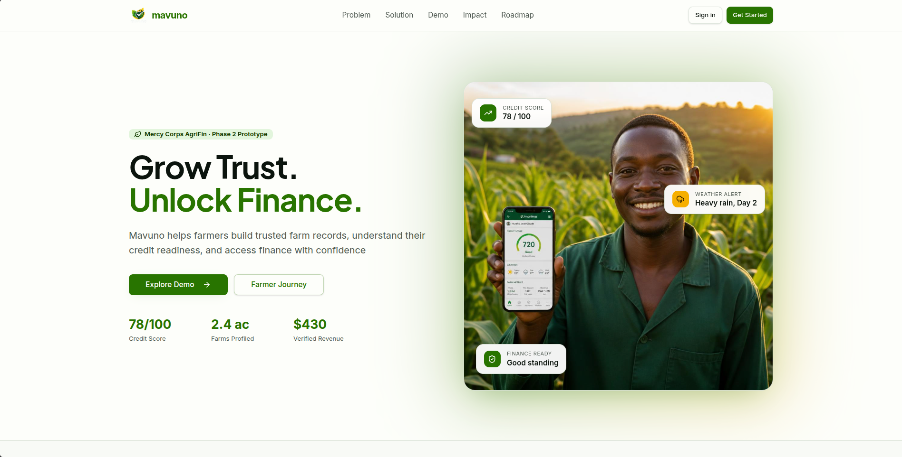
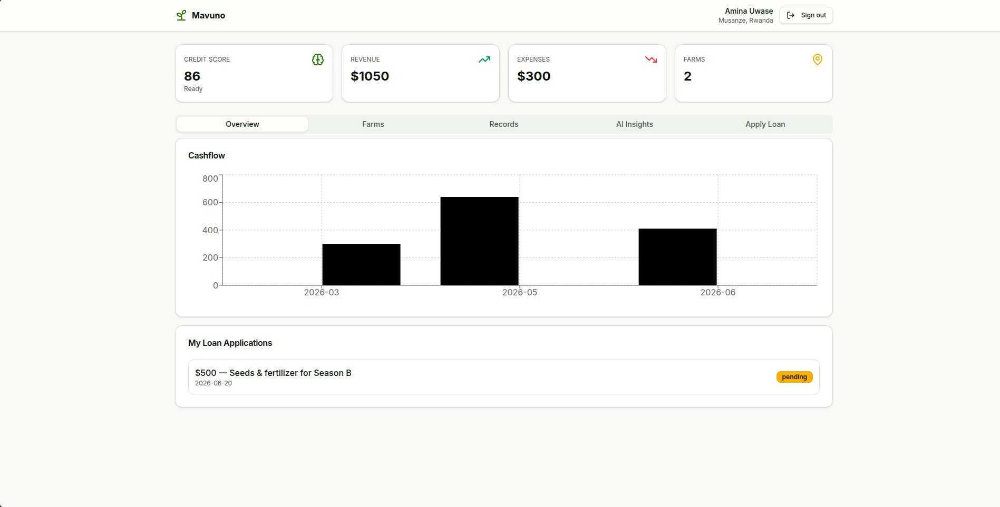
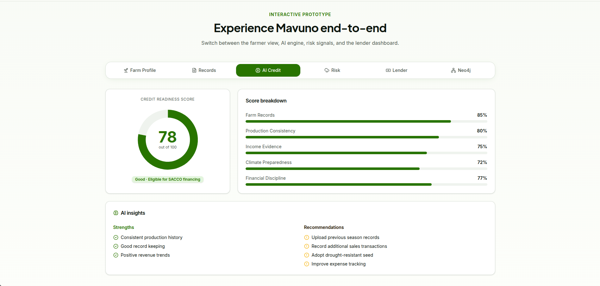
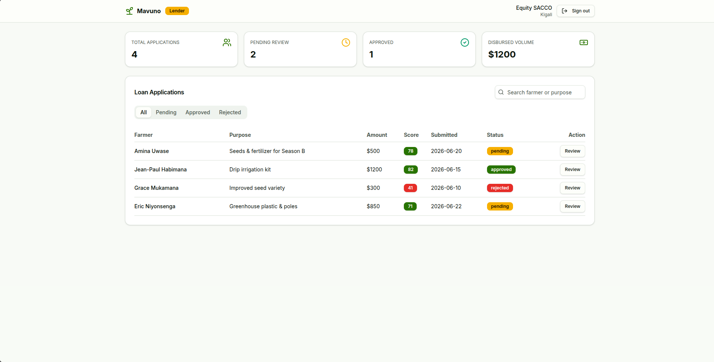

# Mavuno

> **AI-powered web platform that helps farmers build trusted farm records, understand their credit readiness, and access finance more easily.**

## About Mavuno

Many smallholder farmers struggle to get loans because they cannot provide the records lenders need to understand their farms.

Mavuno helps farmers keep simple digital records of their farm activities, production, sales, and expenses. It also uses weather and soil information to build a trusted farm profile that supports fairer and faster lending decisions.

## The Problem

Smallholder farmers often face challenges accessing finance because they lack:

* Farm records
* Production history
* Sales records
* Expense records
* Trusted business information

Without these records, lenders have limited information to assess risk and often decline loan applications.

## Our Solution

Mavuno helps farmers:

* Register their farms
* Record daily farm activities
* Track production
* Record sales and expenses
* Monitor farm inputs
* View their Credit Readiness Score
* Receive recommendations to improve their finance readiness

Lenders can:

* View farmer profiles
* Understand farm performance
* Review weather and soil risks
* Make faster and more informed lending decisions

# Screenshots

## Homepage

## Farmer Dashboard

## Lender Dashboard

## Features

* Farmer Registration
* Farm Management
* Production Records
* Sales & Expense Tracking
* Credit Readiness Dashboard
* Weather Risk Indicators
* Soil Health Insights
* AI Recommendations
* Lender Risk Profile
* Neo4j Knowledge Graph

## Built With

* React
* TypeScript
* Tailwind CSS
* Neo4j
* Masumi
* Featherless AI
* Open-Meteo API
* SoilGrids API

## Team

**Mavuno Team**

* Juliet Atieno
* George Okumu
* Eric Nzyoka
* Ferdinand Odhiambo
* Gerald Kombo

## Challenge

Built for the **Mercy Corps AI for AgriFin Challenge**.

**Official Brief**

**Shambapro - AI Powered Credit Readiness and Farm Risk Profiling for Smallholder Farmers**

## License

This project was developed for the Mercy Corps AI for AgriFin Challenge as a prototype demonstrating innovative approaches to agricultural finance.
